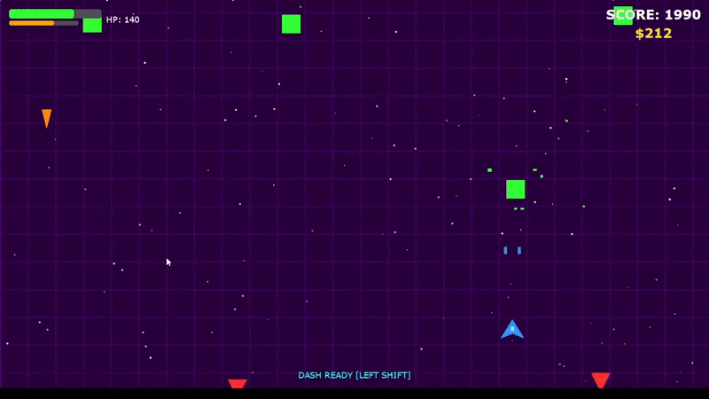
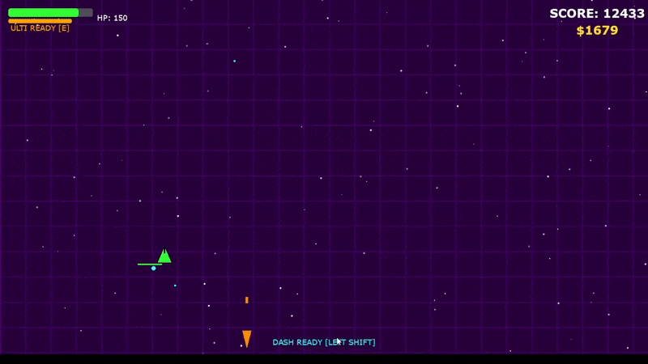

# 🌌 NEON DEFENDER


> **"Zero Assets, Pure Engineering."**

**Neon Defender** is a fast-paced, retro-arcade space shooter engineered using Python and Pygame.

What distinguishes this project is its **zero-asset architecture**. It relies on no external image or audio files. Every visual element is drawn via vector commands, and every sound effect is synthesized in real-time using mathematical waveforms (Digital Signal Processing).

---

## 📸 Gameplay Showcase

### Intense Boss Battles
The adaptive Boss AI uses complex trigonometric patterns to challenge the player.

*A screenshot showing an intense moment during a Boss encounter.*

### Massive EMP Attack
Players can unleash devastating ultimate abilities to turn the tide of battle.

*A screenshot capturing the moment an EMP Blast wipes the screen.*

---

## ⚙️ Key Engineering Features

This project serves as a demonstration of several advanced computer engineering concepts applied to game development:

### 1. Procedural Audio Engine (DSP)
Instead of loading pre-recorded `.wav` files, the game features a custom `SoundEngine` class that utilizes **NumPy** to generate audio buffers programmatically.
* **Real-time Synthesis:** Generates Sine, Square, and Sawtooth waveforms on the fly.
* **Envelope Application:** Applies decay and slide effects to create distinct retro SFX for lasers, explosions, and power-ups.

### 2. Robust Smart Persistence
A sophisticated JSON-based save system ensures data integrity and cross-platform compatibility.
* **Dynamic Path Resolution:** Automatically detects the appropriate OS-specific user data directory (e.g., `%AppData%` on Windows, `.local/share` on Linux) for secure storage.
* **Multi-Slot Architecture:** Supports 3 manual save slots and an automated auto-save slot.
* **Serialization:** Complex states (player stats, shop purchases, achievements) are serialized into structured JSON format.

### 3. State-Machine Driven Boss AI
The primary antagonist is governed by a reactive state machine, offering dynamic gameplay challenges.
* **Phase Transitions:** The Boss enters an "Enraged" state upon reaching 50% health, altering its color palette and attack speed.
* **Trigonometric Attack Patterns:**
    * **Spiral & Flower:** Utilizes `sin` and `cos` functions to generate rotating and radial bullet-hell patterns.
    * **Aimed Shots:** Calculates vectors to predict player movement for targeted attacks.

### 4. Modular Achievement System
A decoupled `AchievementManager` handles progression tracking outside the main game loop. It uses concise `lambda` functions for real-time condition checking (e.g., `lambda game: game.money >= 5000`).

---

## 🎮 Gameplay Overview

### Ship Classes
Choose from 4 distinct strategic hulls at the start:
1.  **INTERCEPTOR (Blue):** Balanced stats for versatile gameplay.
2.  **DESTROYER (Purple):** High HP tank build, slower movement.
3.  **SPEEDER (Yellow):** Extreme mobility for hit-and-run tactics.
4.  **SNIPER (Green):** immense single-shot damage with low fire rate.

### The Upgrade Shop
Accessible via the main menu or in-game (`I` key). Players can spend currency on basic stat boosts or specialized equipment like **Double Shot**, **Autonomous Attack Drones**, and **Homing Missiles**.

---

## 🕹️ Controls

| Key | Action | Description |
| :--- | :--- | :--- |
| **W, A, S, D** | Movement | Pilot the ship. |
| **SPACE** | Shoot | Fire main weapon. |
| **LSHIFT** | Dash | Quick boost with temporary invulnerability frames. |
| **E** | Ultimate Ability | Activates the EMP Blast (screen clear). |
| **I** | Shop | Toggles the in-game upgrade menu. |
| **ESC** | Menu / Pause | Pause game or return to previous menu. |
| **P** | Quick Pause | Instantly pause the action. |

---

## 🛠️ Installation & Usage

Python 3.x is required to run this project.

**1. Clone the Repository:**
```bash
git clone [https://github.com/YOUR_USERNAME/Neon-Defender.git](https://github.com/YOUR_USERNAME/Neon-Defender.git)
cd Neon-Defender
```
**2. Install Dependecies:**
```bash
pip install -r requirements.txt
```
**3. Run the Game:**
```bash
python game.py
```
👨‍💻 Author
[Mustafa Cagatay Ozdem] - Computer Engineering Student @ KTÜ

GitHub: https://github.com/cagatay005

LinkedIn: https://www.linkedin.com/in/mustafa-%C3%A7a%C4%9Fatay-%C3%B6zdem-04199a2b7/
